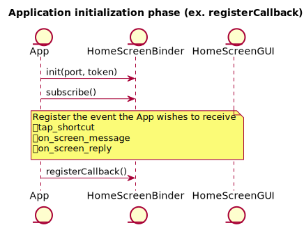
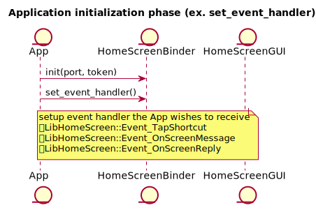

**HomeScreen GUI Application / HomeScreen Service Guide**
====
<div align="right">Revision: 0.1</div>
<div align="right">TOYOTA MOTOR CORPORATION</div>
<div align="right">Advanced Driver Information Technology</div>
<div align="right">26th/Sep/2017</div>

* * *

<div id="Table\ of\ content"></div>

## Table of content
- [Target reader of this document](#Target\ reader\ of\ this\ document)
- [Overview](#Overview)
- [Getting Start](#Getting\ Start)
	- [Supported environment](#Supported\ environment)
	- [Build](#Build)
	- [Configuring](#Configuring)
	- [How to call HomeScreen APIs from your Application?](#How\ to\ call\ HomeScreen\ APIs\ from\ your\ Application?)
- [Supported usecase](#Supported\ usecase)
- [Software Architecture](#Software\ Architecture)
- [API reference](#API\ reference)
- [Sequence](#Sequence)
	- [Initialize](#InitializeSequence)
	- [Tap Shortcut](#TapShortcutSequence)
	- [On Screen Message / Reply Sequence](#OnScreenMessageSequence)
- [Sample code](#Sample\ code)
- [Limitation](#Limitation)
- [Next Plan](#Next\ Plan)

* * *

<div id="Target\ reader\ of\ this\ document"></div>

## Target reader of this document
Application developer whose software uses HomeScreen.

* * *

<div id="Overview"></div>

## Overview
HomeScreenはQtで作成されたGUIアプリケーション(以下、HomeScreenGUI)と、afb-daemonで動作するサービス(以下HomeScreenBinder)で構築されます。HomeScreeはAGLにて動作するアプリケーションの起動、切り替え、およびオンスクリーンメッセージなどの情報表示を行います。

HomeScreenGUIはWindowManagerが提供するAPIを使用しています。

<div id="Getting\ Start"></div>

## Getting Start

<div id="Supported\ environment"></div>

### Supported environment
| Item        | Description                       |
|:------------|:----------------------------------|
| AGL version | Daring Dab                        |
| Hardware    | Renesas R-Car Starter Kit Pro(M3) |


<div id="Build"></div>

### Build

You can make HomeScreen object files by the following two stage operations.

**Download recipe**

If repo is already done, please start with git clone

```
$ mkdir WORK
$ cd WORK
$ repo init -b dab -m dab_4.0.0_xml -u https://gerrit.automotivelinux.org/gerrit/AGL/AGL-repo
$ repo sync
$ git clone git clone https://gerrit.automotivelinux.org/gerrit/staging/meta-hmi-framework

```

Then you can get the following recipe.

* `meta-hmi-framework/homescreen-2017`


**Bitbake**

```
$ source meta-agl/scripts/aglsetup.sh -m m3ulcb agl-demo agl-devel agl-appfw-smack
$ bitbake homescreen-2017
```


* * *

<div id="Configuring"></div>

### Configuring
To use HomeScreen API, an application shall paste the following configuration definition into "config.xml" of application.

```
<feature name="urn:AGL:widget:required-api">
	<param name="homescreen" value="ws" />
</feature>
```

*) HomeScreenBindingはWindowManagerと同じport、tokenでのアクセスとなります。

* * *

<div id="How\ to\ call\ HomeScreen\ APIs\ from\ your\ Application?"></div>

### How to call HomeScreen APIs from your Application?
HomeScreen provides a library which is called "libhomescreen".  
This library treats "json format" as API calling.  
For example, if an application wants to call "tap_shortcut()" API, the you should implement as below.  

At first the application should create the instance of libhomescreen.

```
LibHomeScreen* libhs;
libhs = new LibHomeScreen();
libhs->init(port, token);
```

The port and token is provided by Application Framework

Execute the "tapShortcut()" function.

```
libhs->tapShortcut("application_name");
```

Regarding the detail of tap_shortcut() API, please refer [this](#HomeScreen\ API) section.  
The first parameter is the name of API, so in this case "tap_shortcut" is proper string.  
And the second parameter corresponds to arguments of "connect()" API.  


See also our [Sample code](#Sample\ code).


<br />

* * *

<div id="Supported\ usecase"></div>

## Supported usecase
1. HomeScreenGUIでショートカットアイコンがタップされたときに発行されるイベントを取得する
	- 各アプリケーションは自身がアイコンタップにより起動（または表示）されたことを知るために、HomeScreenBinderに対してイベント登録を行い、そのイベントを取得することができます。
2. オンスクリーンにメッセージを表示する
	- 各アプリケーションからメッセージを取得し、オンスクリーンに取得したメッセージを表示することができます。
3. オンスクリーンからのReplayを取得する
	- オンスクリーンを表示した際に、各アプリケーションに返答することができます。

* * *

<div id="Software\ Architecture"></div>

## Software Architecture
The architecture of HomeScreen is shown below.  
HomeScreen is the service designed to be used by multiple applications.  
Therefore HomeScreen framework consists on two binder layers. Please refer the following figure.  
The upper binder is for application side security context for applications. The lower binder is for servide side security context.  
Usually application side binder has some business logic for each application, so the number of binders depend on the number of applications which use HomeScreen.  
On the other hand, regarding lower binder there is only one module in the system. This binder receives all messages from multiple applications (in detail, it comes from upper layer binder).

The communication protocols between libhomescreen and upper binder, upper binder and lower binder, lower binder (homescreen-binding) are WebSocket.


* * *

<div id="API%20reference"></div>

## API reference
"libhomescreen" and "HomeScreenBinding" provides several kinds of APIs.

<div id="Home\ Screen\ Specific\ API"></div>

### HomeScreen Specific API

- [LibHomeScreen ()](api-ref/html/de/dd0/class_lib_home_screen.html#a724bd949c4154fad041f96a15ef0f5dc)
- [init (const int port, const std::string &token)](api-ref/html/de/dd0/class_lib_home_screen.html#a6a57b573cc767725762ba9beab032220)
- [tapShortcut(const char *application_name)](api-ref/html/de/dd0/class_lib_home_screen.html#afb571c9577087b47065eb23e7fdbc903)
- [onScreenMessage(const char *display_message)](api-ref/html/de/dd0/class_lib_home_screen.html#ac336482036a72b51a822725f1929523c)
- [onScreenReply(const char *reply_message)](api-ref/html/de/dd0/class_lib_home_screen.html#a6c065f41f2c5d1f58d2763bfb4da9c37)
- [registerCallback (void(*event_cb)(const std::string &event, struct json_object *event_contents), void(*reply_cb)(struct json_object *reply_contents), void(*hangup_cb)(void)=nullptr)](api-ref/html/de/dd0/class_lib_home_screen.html#a2789e8a5372202cc36f48e71dbb9b7cf)
- [set\_event\_handler(enum EventType et, handler_func f)](api-ref/html/de/dd0/class_lib_home_screen.html#ab1b0e08bf35415de9064afed899e9f85)
- [call (const string& verb, struct json_object* arg)](api-ref/html/de/dd0/class_lib_home_screen.html#a527b49dcfe581be6275d0eb2236ba37f)
- [call (const char* verb, struct json_object* arg)](api-ref/html/de/dd0/class_lib_home_screen.html#ab5e8e8ab7d53e0f114e9e907fcbb7643)
- [subscribe (const string& event_name)](api-ref/html/de/dd0/class_lib_home_screen.html#aa4c189807b75d070f567967f0d690738)
- [unsubscribe (const string& event_name)](api-ref/html/de/dd0/class_lib_home_screen.html#aac03a45cbd453ba69ddb00c1016930a6)

* * *

<div id="Sequence"></div>

## Sequence

<div id="InitializeSequence"></div>

### Initialize Sequence
 * deprecated


<div id="TapShortcutSequence"></div>

### Tap Shortcut Sequence


<div id="OnScreenMessageSequence"></div>

### On Screen Message / Reply Sequence


<div id="Sample\ code"></div>

# Sample code
You can find sample implementation of HomeScreen as below.

* `HomeScreenBinding/libhomescreen/test.cpp`

### Appendix

```
@startuml
title Application initialization phase (ex. registerCallback)
entity App
entity HomeScreenBinder
entity HomeScreenGUI
App->HomeScreenBinder: init(port, token)
App->HomeScreenBinder: subscribe()

note over HomeScreenBinder
    Register the event the App wishes to receive
    ・tap_shortcut
    ・on_screen_message
    ・on_screen_reply
end note

App->HomeScreenBinder: registerCallback()

@enduml
```

```
@startuml
title Application initialization phase (ex. set_event_handler)
entity App
entity HomeScreenBinder
entity HomeScreenGUI
App->HomeScreenBinder: init(port, token)
App->HomeScreenBinder: set_event_handler()

note over HomeScreenBinder
    setup event handler the App wishes to receive
    ・LibHomeScreen::Event_TapShortcut
    ・LibHomeScreen::Event_OnScreenMessage
    ・LibHomeScreen::Event_OnScreenReply
end note

@enduml
```

```
@startuml
title Application Callback Event TapShortcut phase
entity App
entity HomeScreenBinder
entity HomeScreenGUI
App->HomeScreenBinder: set_event_handler()

note over App
    LibHomeScreen::Event_TapShortcut
end note

HomeScreenGUI->HomeScreenBinder: tapShortcut(application_name)
HomeScreenBinder->App: event_handler(application_name)
@enduml
```

```
@startuml
title Application Callback Event On Screen Message / Reply phase
entity App
entity HomeScreenBinder
entity HomeScreenGUI

HomeScreenGUI->HomeScreenBinder: set_event_handler()

note over HomeScreenGUI
    LibHomeScreen::Event_OnScreenMessage
end note


App->HomeScreenBinder: set_event_handler()

note over App
    LibHomeScreen::Event_OnScreenReply
end note

App->HomeScreenBinder: onScreenMessage(display_message)
HomeScreenBinder->HomeScreenGUI: event_handler(display_message)
HomeScreenGUI->HomeScreenBinder: onScreenReply(reply_message)
HomeScreenBinder->App: event_handler(reply_message)
@enduml
```